# Magisk Furtif [](https://github.com/Furtif/magisk-furtif/actions) [](https://opensource.org/licenses/ECL-2.0)

A comprehensive Magisk module that automates the management and monitoring of FurtiF™ Tools on Android devices with advanced notification and recovery capabilities.

## ⚡ Features

- **Automatic Application Monitoring**: Continuously monitors FurtiF™ Tools and App processes
- **Smart Recovery System**: Automatically restarts applications when they crash or become unresponsive
- **Discord Integration**: Real-time status updates and alerts via Discord webhooks
- **Rotom API Support**: Device health monitoring through external API integration
- **Cross-Platform Compatibility**: Supports various Android versions and device types
- **Configurable Settings**: Easy-to-modify configuration for different environments

## 📝 Requirements

- **Magisk**: v15.3.0 or higher
- **Android**: Compatible with most Android versions
- **Termux**: Recommended for dependency management (curl, jq)
- **Root Access**: Required for Magisk module functionality

## 🔧 Installation

### Build from Source

```bash
# Clone the repository
git clone https://github.com/Furtif/magisk-furtif
cd magisk-furtif

# Configure the service script for your device
nano base/common/service.sh

# Build the module
python3 build.py

# Find your built module in the builds/ directory
ls builds/
```

**⚠️ Important**: Always review and sanitize configuration files before building to ensure no sensitive information is included.

## ⚙️ Configuration

### Essential Configuration

Before installing, you must configure the service script for your specific device:

```bash
# Edit the configuration
nano base/common/service.sh
```

#### Key Configuration Options:

| Variable | Description | Default Value |
|----------|-------------|---------------|
| `DEVICE_NAME` | Device identifier for notifications | `"Pixel5"` |
| `BINDIR` | Termux binary directory path | `"/data/data/com.termux/files/usr/bin"` |
| `DISCORD_WEBHOOK_URL` | Discord webhook for notifications | `"YOUR_WEBHOOK_URL_HERE"` |
| `USE_DISCORD` | Enable/disable Discord notifications | `false` |
| `ROTOMAPI_URL` | Rotom API endpoint for status checks | `"YOUR_ROTOM_URL_HERE"` |
| `USE_ROTOM` | Enable/disable Rotom API integration | `false` |
| `ROTOMAPI_USER` | Rotom API username (if auth required) | `"YOUR_USERNAME_HERE"` |
| `ROTOMAPI_PASSWORD` | Rotom API password (if auth required) | `"YOUR_PASSWORD_HERE"` |
| `ROTOMAPI_USE_AUTH` | Enable/disable Rotom API authentication | `false` |
| `PACKAGE_NAME` | Package name to monitor | `"com.xxxx.xxxx.yyy"` |
| `LOADER_TIME` | Application startup wait time in seconds | `40` |

### Termux Binary Directory Paths

Choose the correct path based on your Android version and device type:

- **Android 14+**: `/data/data/com.termux/files/usr/bin`
- **ATV devices (e.g., H96)**: `/system/xbin`
- **Other devices**: `/vendor/bin` or `/system/bin`
- **Play Store Termux**: `/data/data/com.termux/files/usr/bin`

### Discord Setup

1. Create a Discord server and channel
2. Go to Server Settings → Integrations → Webhooks
3. Create a new webhook and copy the URL
4. Set `USE_DISCORD=true` and update `DISCORD_WEBHOOK_URL`

### Termux Dependencies

Install required dependencies in Termux:

```bash
pkg update
pkg install curl
pkg install jq
```

## 🔄 How It Works

### Boot Process

1. **Service Initialization**: The module starts as a Magisk late_start service
2. **System Stability**: Waits for boot completion and system stabilization
3. **Application Monitoring**: Begins continuous monitoring of target applications

### Monitoring Loop

The service runs a continuous monitoring loop with the following logic:

```mermaid
graph TD
    A[Start Monitoring] --> B{Check App Status}
    B -->|Apps Running| C[Wait 5 Minutes]
    B -->|Apps Not Running| D[Force-Stop Apps]
    D --> E[Restart FurtiF™ Tools]
    E --> F[Wait 5 Seconds]
    F --> B
    C --> G{Rotom API Enabled?}
    G -->|Yes| H[Check Device Status]
    G -->|No| B
    H --> I[Send Status Update]
    I --> B
```



### Recovery Procedures

When applications are detected as offline:

1. **Force Stop**: Both FurtiF™ Tools and App are force-stopped
2. **Notification**: Discord alert is sent (if enabled)
3. **Restart**: FurtiF™ Tools is automatically restarted
4. **Verification**: System waits and verifies successful startup

## 🔧 Advanced Configuration

### Custom Timing Parameters

Adjust timing values in `service.sh` for your device performance:

```bash
# Application startup wait time (default: 40 seconds)
LOADER_TIME=40

# Main monitoring interval (default: 300 seconds = 5 minutes)
sleep 300

# Boot stabilization delay (default: 15 seconds)
sleep 15
```

### Optional System Modifications

Uncomment and configure optional features:

```bash
# OpenGL ES version configuration
# resetprop ro.opengles.version=196608

# Screen unlock automation
# input keyevent 26
# input touchscreen swipe 930 880 930 380
```

## 🔍 Troubleshooting

### Common Issues

#### Module Not Starting
- Verify Magisk version (v15.3.0+)
- Check module installation logs in Magisk Manager
- Ensure proper root access
- Confirm service.sh has correct permissions (`chmod +x`)

#### Applications Not Detected
- Check if applications are actually installed
- Verify process names with `ps -A | grep app*`

#### Discord Notifications Not Working
- Verify webhook URL is correct and accessible
- Check `USE_DISCORD=true` in configuration
- Test webhook manually: `curl -X POST -H "Content-Type: application/json" -d '{"content":"test"}' YOUR_WEBHOOK_URL`
- Ensure Discord channel has webhook permissions

#### Rotom API Integration Issues
- Verify API endpoint is accessible from your device
- Check authentication credentials if `ROTOMAPI_USE_AUTH=true`
- Test API manually: `curl -u "user:pass" YOUR_ROTOM_URL`
- Check device name matches exactly in Rotom system

#### Termux Dependencies Missing
```bash
# Install missing dependencies
pkg update
pkg install curl jq

# Verify installation
which curl jq
curl --version
jq --version
```

#### Service Script Errors
- Check script syntax: `sh -n base/common/service.sh`
- Verify binary paths in `BINDIR` variable
- Test individual functions manually
- Check system logs: `logcat | grep magiskfurtif`

## 📈 Monitoring Dashboard

### Discord Integration

The module sends rich embed messages to Discord including:

- ✅ **Status Updates**: Device online and healthy
- ⚠️ **Alerts**: Device offline or low memory
- 🔄 **Recovery Actions**: Application restart notifications
- ❌ **Critical Issues**: API failures or device not found

### Rotom API Integration

When enabled, the module monitors:

- Device alive status (`isAlive`)
- Free memory (`memFree`)
- API connectivity and authentication

## 🏗️ Project Structure

```
magisk-furtif/
├── base/                          # Module source files
│   ├── META-INF/
│   │   └── com/google/android/    # Flashable zip metadata
│   ├── common/
│   │   ├── service.sh             # Main service script
│   │   ├── post-fs-data.sh        # Post-filesystem script
│   │   └── system.prop             # System properties
│   └── install.sh                 # Installation script
├── .github/workflows/             # CI/CD configuration
├── builds/                        # Built module outputs
├── build.py                       # Build script
├── LICENSE.md                     # License information
└── README.md                      # This file
```

## 🤝 Contributing

Contributions are welcome! Please follow these guidelines:

1. **Fork** the repository
2. **Create** a feature branch
3. **Make** your changes
4. **Test** thoroughly
5. **Submit** a pull request

### Development Setup

```bash
# Clone your fork
git clone https://github.com/yourusername/magisk-furtif
cd magisk-furtif

# Make changes and test
python3 build.py

# Install test module
adb push builds/MagiskFurtif-*.zip /sdcard/
# Flash via Magisk Manager
```

## 📄 License

This project is licensed under the Educational Community License v2.0 (ECL-2.0). See the [LICENSE.md](LICENSE.md) file for details.

## 🔗 Links

- **Releases**: [Latest Releases](https://github.com/Furtif/magisk-furtif/releases)
- **Issues**: [Bug Reports & Feature Requests](https://github.com/Furtif/magisk-furtif/issues)
- **Discussions**: [Community Forum](https://github.com/Furtif/magisk-furtif/discussions)
- **License**: [ECL-2.0 Information](https://opensource.org/licenses/ECL-2.0)

## 🙏 Acknowledgments

- **Magisk**: For the excellent module framework
- **Termux**: For providing Android terminal tools
- **Discord**: For notification integration
- **FurtiF™ Community**: For feedback and testing

---

⚠️ **Disclaimer**: This module is provided as-is for educational and research purposes. Users are responsible for ensuring compliance with applicable terms of service and laws.
